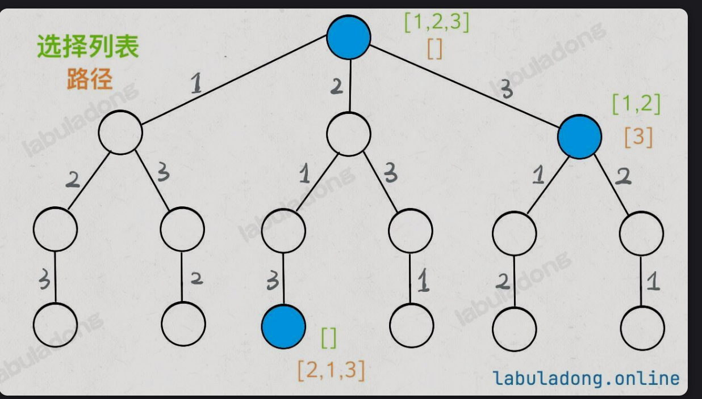

# 回溯算法
1. 抽象的说，回溯算法就是就是遍历一颗决策树的过程，在这个过程中，遇到不满足条件的节点就回退到上一个节点继续遍历，直到遍历完整棵树。
在一个回溯算法的节点上，你需要思考1.路径：也就是已经做出的选择 2.选择列表：也就是当前可以做出的选择 3.结束条件：也就是到达决策树底层，无法再做出选择的条件。

其核心就是for循环里面的递归，在递归调用之前做选择，在递归调用之后撤销选择，这样就可以回退到上一个节点继续遍历。
## 例1：全排列
1. 给定一个不含重复数字的数组 nums ，返回其所有可能的全排列。
这张图中2就是路径，1、3就是选择列表，叶子节点就是结束条件（也就是选择列表为空）

区分一下前序遍历和后序遍历，在前序遍历中，递归调用之前做选择，在后序遍历中，递归调用之后做选择。
2. 代码实现：
```cpp
#include<vector>
#include<list>
class Solution{
    vector<vector<int>> res;//结果列表
    public:
    vector<vector<int>> permute<vector<int>&nums>{
        list<int>track;//路径
        vector<bool>used(nums.size(),false);//选择列表
        backtrack(nums,track,used);
        return res;
    }
    private:
    void backtrack(vector<int>&nums,list<int>&track,vector<bool>&used){
        if(track.size()==nums.size()){
            res.push_back(track);
            return;
        }
        for(int i=0;i<nums.size();i++){
            if(used[i]==true){
                continue;
            }
            track.push_back(nums[i]);//做选择
            used[i]=true;
            backtrack(nums,track,used);//进入下一层决策树
            track.pop_back();//撤销选择
            used[i]=false;
            return;
        }
    }
};
```

